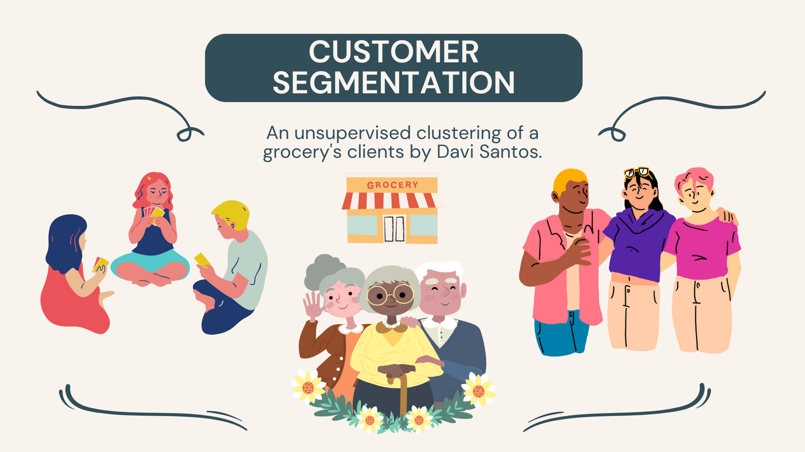

<center></center>


	
# Customer Segmentation
This project aims to make a customer segmentation of a grocery's clients using unsupervised machine learning models. By the end of this project, we will have:
- A pdf report file showing a detailed analysis of the grocery's clients and the customer segmentations made by the unsupervised machine learning models;
- A dashboard showing interactive graphs that contains insights for managers and leaders.

For those who want to see these project final results, these files will be available in the reports folder.

Additionally, if you are interested in the preprocessing, exploratory data analysis and modeling steps, check out the next sections to see more.

Currently, this project is under development.

## Requirements
To run this repository on your environment, make sure you have the following softwares installed and configured on your machine:
- [git](https://git-scm.com/) 2.37.2 or newer;
- [python](https://www.python.org/) 3.10 or newer;
- [pip](https://pip.pypa.io/en/stable/installation/) 22.0.4 or newer.

## Installation
Clone the project using the git command on your terminal:
```bash
git clone https://github.com/davi-santos/customer-segmentation.git
```
Inside the folder, install the python libraries using the command below. You can also create your own virtual python environment and run the command below, both will work.
```bash
pip install -r requirements.txt
```

## Download the data
Download the data on kaggle [here](https://www.kaggle.com/datasets/imakash3011/customer-personality-analysis) and save it on /data/raw directory. Now, you are ready to reproduce all the files and jupyter notebooks of this project.

## Project Organization

This project structure were based on [cookiecutter]() layout and were simplified in this structure:

    ├── README.md          <- The top-level README for developers using this project.
    ├── requirements.txt   <- The requirements file for reproducing the analysis environment, e.g.
    │                         generated with `pip freeze > requirements.txt`
    ├── data
    │   ├── external       <- Data from third party sources. In this project, there are none.
    │   ├── interim        <- Intermediate data that has been transformed.
    │   ├── processed      <- The final, canonical data sets for modeling.
    │   └── raw            <- The original, immutable data dump. Save your kaggle data here.
    │
    ├── models             <- Trained and serialized models, model predictions, or model summaries
    │
    ├── notebooks          <- Jupyter notebooks. Naming convention is a number (for ordering),
    │                         the creator's initials, and a short `-` delimited description, e.g.
    │                         `1.0-jqp-initial-data-exploration`.
    │
    ├── references         <- Data dictionaries, manuals, and all other explanatory materials.
    │
    ├── reports            <- Generated analysis as HTML, PDF, LaTeX, etc.
    │   └── figures        <- Generated graphics and figures to be used in reporting
    │
    ├── src                <- Source code for use in this project.
    │   ├── __init__.py    <- Makes src a Python module
    │   │
    │   ├── data           <- Scripts to download or generate data
    │   │   └── make_dataset.py
    │   │
    │   ├── features       <- Scripts to turn raw data into features for modeling
    │   │   └── build_features.py
    │   │
    │   ├── models         <- Scripts to train models and then use trained models to make
    │   │   │                 predictions
    │   │   ├── predict_model.py
    │   │   └── train_model.py
    │   │
    │   └── visualization  <- Scripts to create exploratory and results oriented visualizations
    │       └── visualize.py


